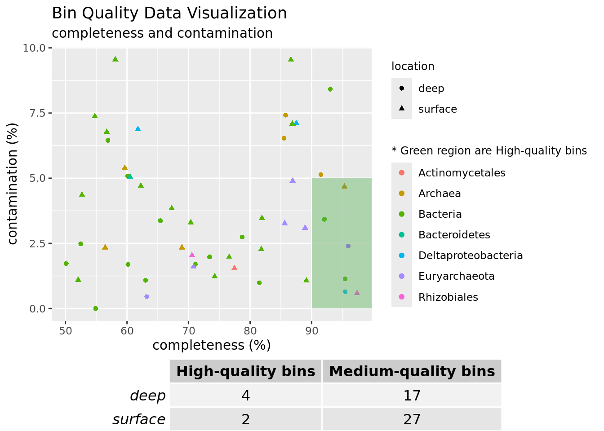
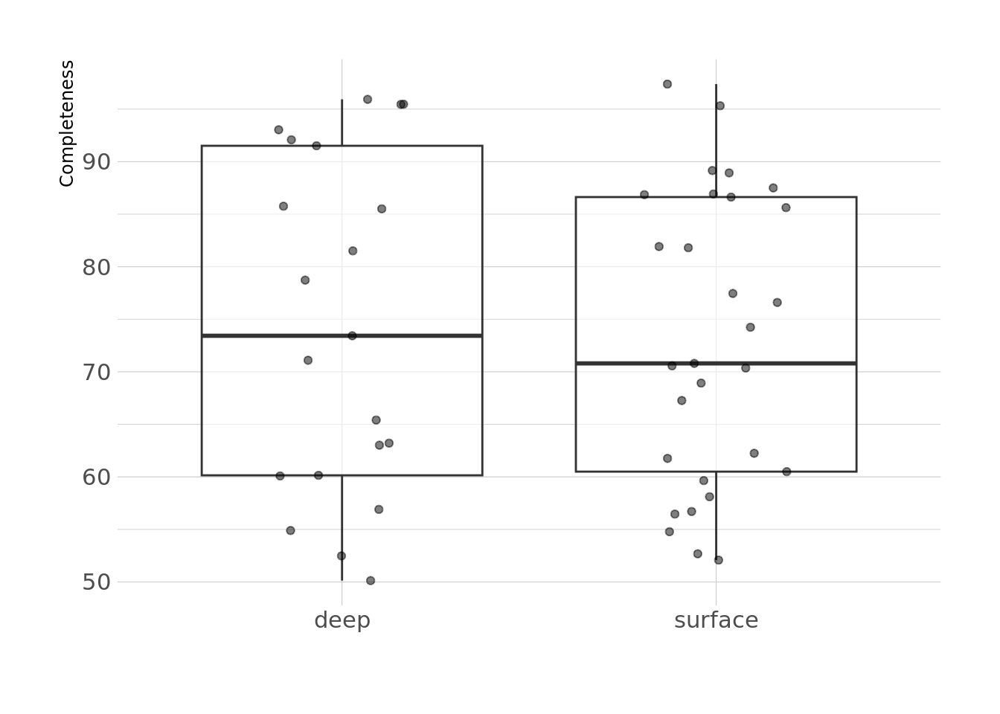
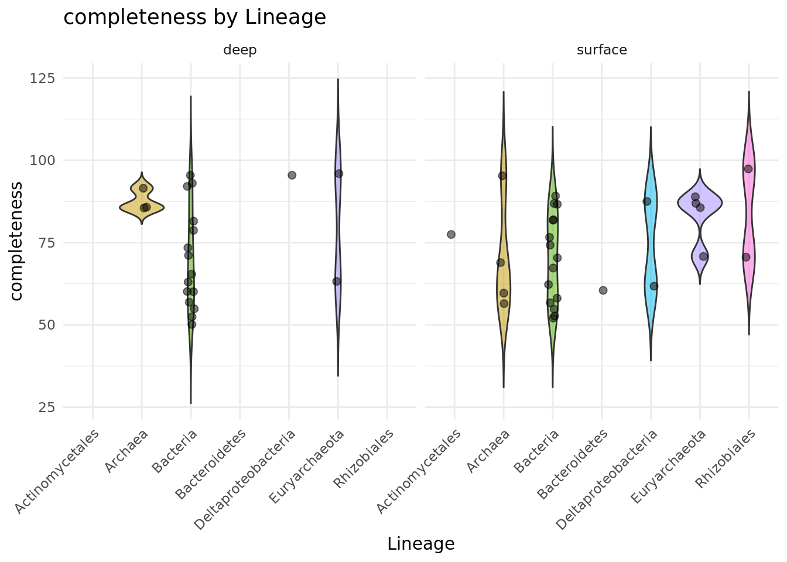
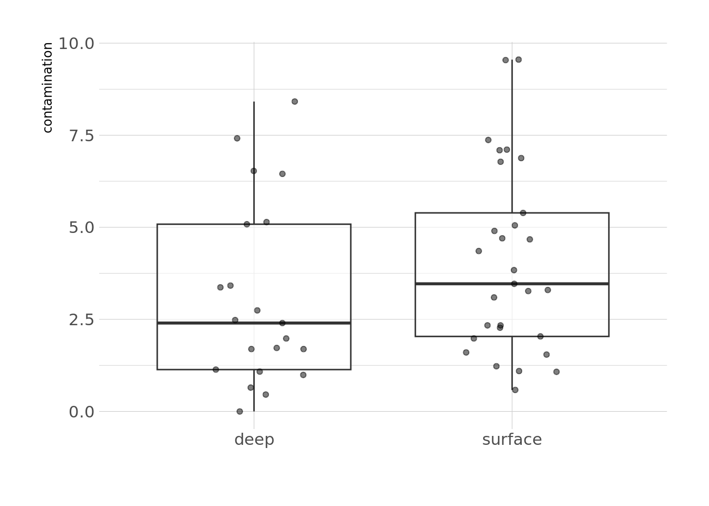
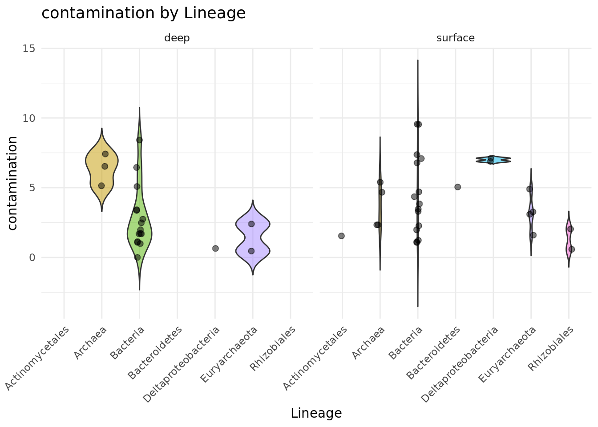
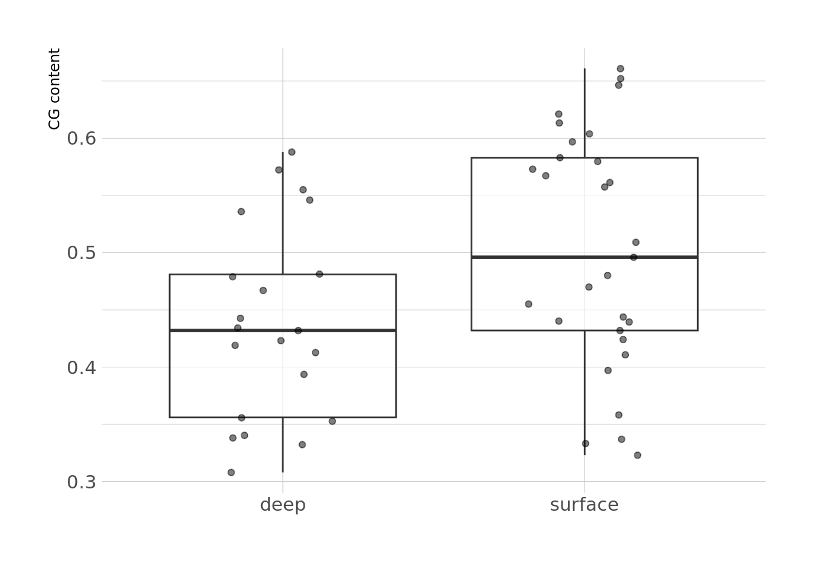
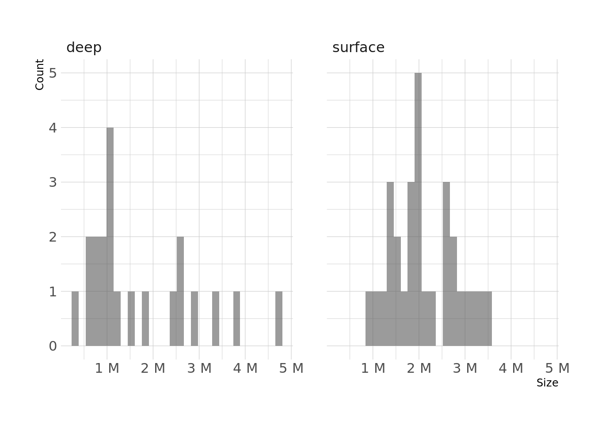
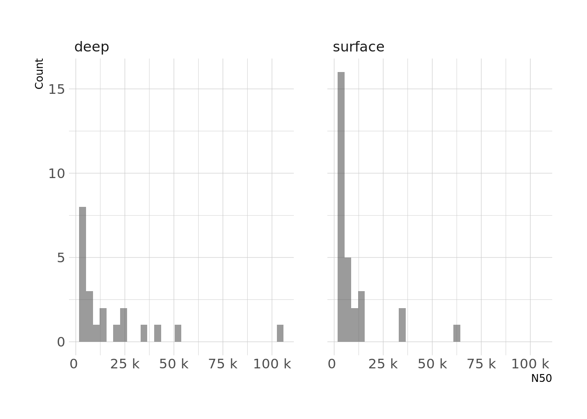
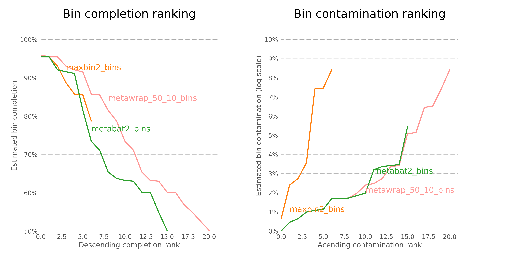
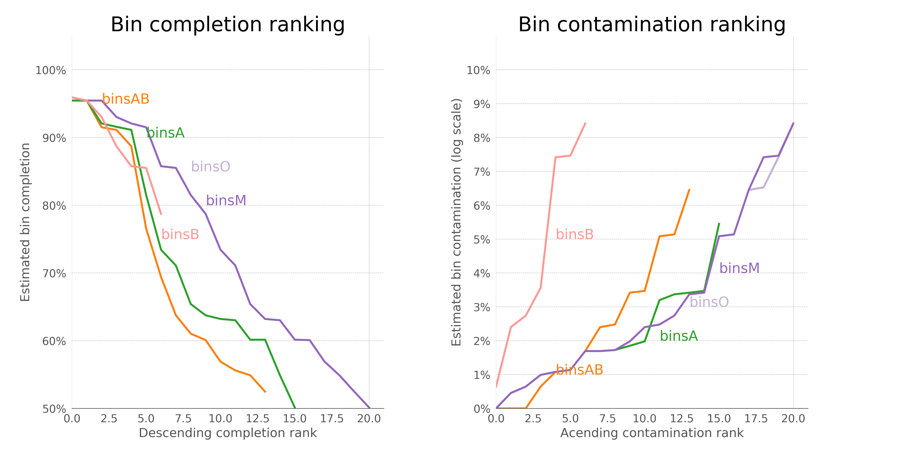

<!DOCTYPE html>
<html xmlns="http://www.w3.org/1999/xhtml" lang="en" xml:lang="en"><head>

<meta charset="utf-8">
<meta name="generator" content="quarto-1.5.57">

<meta name="viewport" content="width=device-width, initial-scale=1.0, user-scalable=yes">

<title>Bin Quality Report</title>

<link href="main_files/libs/quarto-html/tippy.css" rel="stylesheet">
<link href="main_files/libs/quarto-html/quarto-syntax-highlighting.css" rel="stylesheet" id="quarto-text-highlighting-styles">

<link href="main_files/libs/bootstrap/bootstrap-icons.css" rel="stylesheet">
<link href="main_files/libs/bootstrap/bootstrap.min.css" rel="stylesheet" id="quarto-bootstrap" data-mode="light">

</head>

<body class="fullcontent">

<main class="content" id="quarto-document-content">

<header id="title-block-header" class="quarto-title-block default">

<h1 class="title">Bin Quality Report</h1>

    
  
    
  

  

</header>

<i class="callout-icon"></i>

Tip

<strong>Table of Contents</strong> 
Below is the list of sections covered in this document. 
Click on any section to quickly navigate to it.

<ol type="1">
<li><a href="#Library_and_Data_Import">Library and Data Import</a> </li>
<li><a href="#Overview">Overview</a> </li>
<li><a href="#completeness">completeness</a> </li>
<li><a href="#bins_completeness_scores_based_on_lineage">bins completeness scores based on lineage</a> </li>
<li><a href="#contamination">contamination</a> </li>
<li><a href="#bins_contamination_scores_based_on_lineage">bins contamination scores based on lineage</a> </li>
<li><a href="#bins_CG_content_based_on_lineage">Bins CG content based on lineage</a> </li>
<li><a href="#Bin_size">Bin size</a> </li>
<li><a href="#N50">N50</a> </li>
<li><a href="#Bin_Comparision">Bin comparision</a></li>
</ol>

<section id="Library_and_Data_Import" class="level4">
<h4 class="anchored" data-anchor-id="Library_and_Data_Import">Library and Data Import</h4>

<pre class="sourceCode r code-with-copy"><code class="sourceCode r"># install libraries if they are not availible
# required libraries
libraries &lt;- c("ggplot2", "hrbrthemes", "dplyr", "tidyr", "viridis", 
               "readr", "magick", "scales", "randomNames", "ggrepel", 
               "stringr", "gridExtra", "gt")

# Install missing packages
missing_packages &lt;- libraries[!(libraries %in% installed.packages()[,"Package"])]
if(length(missing_packages)) install.packages(missing_packages, dependencies = TRUE)

# Load required libraries
library(ggplot2)      # Data visualization
library(hrbrthemes)   # Themes for ggplot2
library(dplyr)        # Data manipulation
library(tidyr)        # Data tidying
library(viridis)      # Color palettes
library(readr)        # Data import
library(magick)       # Image processing
library(scales)       # Scaling functions
library(randomNames)  # Generate random names
library(ggrepel)      # Repel overlapping text labels
library(stringr)      # String manipulation
library(gridExtra)    # Arrange multiple plots
library(gt)           # Create tables</code><button title="Copy to Clipboard" class="code-copy-button"><i class="bi"></i></button></pre>

import two csv containing bins quality statistics

<pre class="sourceCode r code-with-copy"><code class="sourceCode r">path_50_10_bins_stats_92 &lt;- "/project/asteen_1130/deep_vs_surface/manual_results/07_bin_refinement/SRR7066492/metawrap_50_10_bins.stats"
data_50_10_bins_stats_92 &lt;- read_tsv(path_50_10_bins_stats_92) |&gt; mutate(location = "deep")

path_50_10_bins_stats_93 &lt;- "/project/asteen_1130/deep_vs_surface/manual_results/07_bin_refinement/SRR7066493/metawrap_50_10_bins.stats"
data_50_10_bins_stats_93 &lt;- read_tsv(path_50_10_bins_stats_93) |&gt; mutate(location = "surface")

combined_data &lt;- bind_rows(data_50_10_bins_stats_92, data_50_10_bins_stats_93)</code><button title="Copy to Clipboard" class="code-copy-button"><i class="bi"></i></button></pre>

</section>
<section id="Overview" class="level4">
<h4 class="anchored" data-anchor-id="Overview">Overview</h4>

<i class="callout-icon"></i>

Note

We identified 29 metagenome-assembled genome (MAG) bins in the surface sample (SRR7066493) and 21 bins in the deep sample (SRR7066492).

Bins with at least 50% completeness and no more than 10% contamination are classified as medium-quality MAGs. In the visualization, completeness and contamination levels of each bin are represented, with the green region highlighting high-quality bins (completeness &gt; 90% and contamination &lt; 5%). All other bins fall into the medium-quality category.

The bin origins are also depicted: circles represent bins from the deep sample, while triangles correspond to bins from the surface sample. Additionally, bin lineage information is conveyed through color coding, allowing for taxonomic differentiation.

<i class="callout-icon"></i>

Reference

<i class="callout-toggle"></i>

The Genome Standards Consortium, Robert M. Bowers, Nikos C. Kyrpides, Ramunas Stepanauskas, Miranda Harmon-Smith, Devin Doud, T. B. K. Reddy, Frederik Schulz, Jessica Jarett, Adam R. Rivers, Emiley A. Eloe-Fadrosh, Susannah G. Tringe, Natalia N. Ivanova, Alex Copeland, Alicia Clum, Eric D. Becraft, Rex R. Malmstrom, Bruce Birren, Mircea Podar, Peer Bork, George M. Weinstock, George M. Garrity, Jeremy A. Dodsworth, Shibu Yooseph, Granger Sutton, Frank O. Glöckner, Jack A. Gilbert, William C. Nelson, Steven J. Hallam, Sean P. Jungbluth, Thijs J. G. Ettema, Scott Tighe, Konstantinos T. Konstantinidis, Wen-Tso Liu, Brett J. Baker, Thomas Rattei, Jonathan A. Eisen, Brian Hedlund, Katherine D. McMahon, Noah Fierer, Rob Knight, Rob Finn, Guy Cochrane, Ilene Karsch-Mizrachi, Gene W. Tyson, Christian Rinke, Alla Lapidus, Folker Meyer, Pelin Yilmaz, Donovan H. Parks, A. Murat Eren, Lynn Schriml, Jillian F. Banfield, Philip Hugenholtz, and Tanja Woyke. 2017. “Minimum Information about a Single Amplified Genome (MISAG) and a Metagenome-Assembled Genome (MIMAG) of Bacteria and Archaea.” Nature Biotechnology 35(8):725–31. doi: 10.1038/nbt.3893.

<pre class="sourceCode r code-with-copy"><code class="sourceCode r">scatter_plot &lt;- ggplot(combined_data, aes(x = completeness, y = contamination)) +
  geom_point(aes(color = lineage, shape = location),size = 1.5) + 
  # Add axes labels, title, and subtitle
  labs(
    title = "Bin Quality Data Visualization",
    subtitle = "completeness and contamination",
    x = "completeness (%)",
    y = "contamination (%)") + 
  geom_rect(aes(xmin = 90, xmax = Inf, ymin = 0, ymax = 5), fill = "light green", alpha = 0.01) +
  labs(color = "* Green region are High-quality bins ") +
  theme(legend.title = element_text(size = 9))

combined_data$bin_quality &lt;- "Medium-quality bins"
combined_data$bin_quality[combined_data$completeness&gt;90 &amp; combined_data$contamination&lt;5] &lt;- "High-quality bins"
freq_table &lt;- table(combined_data$location, combined_data$bin_quality)
table_grob &lt;- tableGrob(freq_table)

# show both
grid.arrange(scatter_plot, table_grob, nrow=2, heights=c(5, 1))</code><button title="Copy to Clipboard" class="code-copy-button"><i class="bi"></i></button></pre>

<figure class="figure">

</figure>

</section>
<section id="completeness" class="level3">
<h3 class="anchored" data-anchor-id="completeness">completeness</h3>

Completeness in metagenome assembly refers to the extent to which the assembled contigs or scaffolds represent the total genomic content of the sampled microbial community. here we first try to compare distribution of completeness in both samples.

<pre class="sourceCode r code-with-copy"><code class="sourceCode r">completeness_plot &lt;- ggplot(data = combined_data, aes(x = location, y = completeness)) +
    geom_boxplot(alpha = 0.6) +  # Adjust transparency if needed
    theme_ipsum() +
    geom_jitter(width = 0.2, alpha = 0.5) +
    labs(x = "", y = "Completeness")  # Removing x-axis label for clarity

completeness_plot</code><button title="Copy to Clipboard" class="code-copy-button"><i class="bi"></i></button></pre>

<figure class="figure">

</figure>

</section>
<section id="bins_completeness_scores_based_on_lineage" class="level3">
<h3 class="anchored" data-anchor-id="bins_completeness_scores_based_on_lineage">bins completeness scores based on lineage</h3>

Here, we present the distribution of completeness scores across different lineages, highlighting variations between surface and deep samples. Notably, the deep samples exhibit a substantial number of archaeal lineages with high completeness, indicating their strong representation in these environments. In contrast, within the surface samples, the Euryarchaeota lineage demonstrates particularly high completeness, suggesting its dominance or prevalence in these conditions.

<pre class="sourceCode r code-with-copy"><code class="sourceCode r">completeness_lineage_plot &lt;- ggplot(data=combined_data, aes(x=lineage, y=completeness, fill=lineage)) +
    geom_violin(alpha=0.5, trim=FALSE) +
    geom_jitter(width=0.1, alpha=0.5, size=2) +  # Adds individual data points
    facet_wrap(~location) +
    theme_minimal() +
    theme(
        legend.position = "none",
        axis.text.x = element_text(angle = 45, hjust = 1)  # Rotates x-axis text
    ) +
    labs(y = "completeness", x = "Lineage", title = "completeness by Lineage")
completeness_lineage_plot</code><button title="Copy to Clipboard" class="code-copy-button"><i class="bi"></i></button></pre>

<figure class="figure">

</figure>

</section>
<section id="contamination" class="level3">
<h3 class="anchored" data-anchor-id="contamination">contamination</h3>

the unwanted sequences in the bins that do not originate from the target microbial community.Let’s have a overall look at contamination in two samples.

<pre class="sourceCode r code-with-copy"><code class="sourceCode r">contamination_plot &lt;- ggplot(data = combined_data, aes(x = location, y = contamination)) +
    geom_boxplot(alpha = 0.6) +  # Adjust transparency if needed
    theme_ipsum() +
    geom_jitter(width = 0.2, alpha = 0.5) +
    labs(x = "", y = "contamination")  # Removing x-axis label for clarity

contamination_plot</code><button title="Copy to Clipboard" class="code-copy-button"><i class="bi"></i></button></pre>

<figure class="figure">

</figure>

</section>
<section id="bins_contamination_scores_based_on_lineage" class="level3">
<h3 class="anchored" data-anchor-id="bins_contamination_scores_based_on_lineage">bins contamination scores based on lineage</h3>

Here, we present the distribution of contamination scores across different lineages The first thing that caught my attention was the level of contamination in Deltaproteobacteria. My initial thought is that the sequence may have high genomic diversity and complexity, or it might share many genomic features with other taxa. Alternatively, it could be due to low abundance and assembly artifacts.

<pre class="sourceCode r code-with-copy"><code class="sourceCode r">contamination_lineage_plot &lt;- ggplot(data=combined_data, aes(x=lineage, y=contamination, fill=lineage)) +
    geom_violin(alpha=0.5, trim=FALSE) +
    geom_jitter(width=0.1, alpha=0.5, size=2) +  # Adds individual data points
    facet_wrap(~location) +
    theme_minimal() +
    theme(
        legend.position = "none",
        axis.text.x = element_text(angle = 45, hjust = 1)  # Rotates x-axis text
    ) +
    labs(y = "contamination", x = "Lineage", title = "contamination by Lineage")
contamination_lineage_plot</code><button title="Copy to Clipboard" class="code-copy-button"><i class="bi"></i></button></pre>

<figure class="figure">

</figure>

</section>
<section id="bins_CG_content_based_on_lineage" class="level3">
<h3 class="anchored" data-anchor-id="bins_CG_content_based_on_lineage">bins CG content based on lineage</h3>

<pre class="sourceCode r code-with-copy"><code class="sourceCode r">CG_content_plot &lt;- ggplot(data = combined_data, aes(x = location, y = GC)) +
    geom_boxplot(alpha = 0.6) +  # Adjust transparency if needed
    theme_ipsum() +
    geom_jitter(width = 0.2, alpha = 0.5) +
    labs(x = "", y = "CG content")  # Removing x-axis label for clarity

CG_content_plot</code><button title="Copy to Clipboard" class="code-copy-button"><i class="bi"></i></button></pre>

<figure class="figure">

</figure>

<pre class="sourceCode r code-with-copy"><code class="sourceCode r">contamination_lineage_plot &lt;- ggplot(data=combined_data, aes(x=lineage, y=contamination, fill=lineage)) +
    geom_violin(alpha=0.5, trim=FALSE) +
    geom_jitter(width=0.1, alpha=0.5, size=2) +  # Adds individual data points
    facet_wrap(~location) +
    theme_minimal() +
    theme(
        legend.position = "none",
        axis.text.x = element_text(angle = 45, hjust = 1)  # Rotates x-axis text
    ) +
    labs(y = "contamination", x = "Lineage", title = "contamination by Lineage")
contamination_lineage_plot</code><button title="Copy to Clipboard" class="code-copy-button"><i class="bi"></i></button></pre>

<figure class="figure">

</figure>

</section>
<section id="Bin_size" class="level3">
<h3 class="anchored" data-anchor-id="Bin_size">Bin size</h3>

numbers are in million. Here we see the size of bins in million base and the frequency of each, we have some bigger bins in deep sample but the frequency of overall big bins is higher in surface sample.

<pre class="sourceCode r code-with-copy"><code class="sourceCode r">size_plot &lt;- ggplot(data=combined_data, aes(x=size)) +
    geom_histogram( alpha=0.6, position = 'identity') +
    facet_wrap(~location) +
    scale_x_continuous(
        labels = scales::label_number(scale_cut = scales::cut_si(""))
    ) +
    theme_ipsum() +
    labs(x = "Size", y = "Count", fill = "")
size_plot</code><button title="Copy to Clipboard" class="code-copy-button"><i class="bi"></i></button></pre>

<figure class="figure">

</figure>

</section>
<section id="N50" class="level3">
<h3 class="anchored" data-anchor-id="N50">N50</h3>

N50 describes the quality of assembled genomes or contigs. It refers to the length at which 50% of the assembled bases are contained in sequences at or above that length. describe the quality of assembled genomes or contigs. It refers to the length at which 50% of the assembled bases are contained in sequences at or above that length.

<pre class="sourceCode r code-with-copy"><code class="sourceCode r">N50_plot &lt;- ggplot(data=combined_data, aes(x=N50)) +
    geom_histogram( alpha=0.6, position = 'identity') +
    facet_wrap(~location) +
    scale_x_continuous(
        labels = scales::label_number(scale_cut = scales::cut_si(""))
    ) +
    theme_ipsum() +
    labs(x = "N50", y = "Count", fill = "")
N50_plot</code><button title="Copy to Clipboard" class="code-copy-button"><i class="bi"></i></button></pre>

<figure class="figure">

</figure>

</section>
<section id="Bin_Comparision" class="level3">
<h3 class="anchored" data-anchor-id="Bin_Comparision">Bin Comparision</h3>

<pre class="sourceCode r code-with-copy"><code class="sourceCode r">binning_results_compare &lt;- image_read("/project/asteen_1130/deep_vs_surface/manual_results/07_bin_refinement/SRR7066492/figures/binning_results.png")
print(binning_results_compare)</code><button title="Copy to Clipboard" class="code-copy-button"><i class="bi"></i></button></pre>

<pre><code># A tibble: 1 × 7
  format width height colorspace matte filesize density  
  &lt;chr&gt;  &lt;int&gt;  &lt;int&gt; &lt;chr&gt;      &lt;lgl&gt;    &lt;int&gt; &lt;chr&gt;    
1 PNG     4800   2400 sRGB       TRUE    501959 +118x+118</code></pre>

<figure class="figure">

</figure>

<pre class="sourceCode r code-with-copy"><code class="sourceCode r">intermediate_binning_results_compare &lt;- image_read("/project/asteen_1130/deep_vs_surface/manual_results/07_bin_refinement/SRR7066492/figures/intermediate_binning_results.png")
print(intermediate_binning_results_compare)</code><button title="Copy to Clipboard" class="code-copy-button"><i class="bi"></i></button></pre>

<pre><code># A tibble: 1 × 7
  format width height colorspace matte filesize density  
  &lt;chr&gt;  &lt;int&gt;  &lt;int&gt; &lt;chr&gt;      &lt;lgl&gt;    &lt;int&gt; &lt;chr&gt;    
1 PNG     4800   2400 sRGB       TRUE    541789 +118x+118</code></pre>

<figure class="figure">

</figure>

</section>

</main>
<!-- /main column -->

 <!-- /content -->

</body></html>
